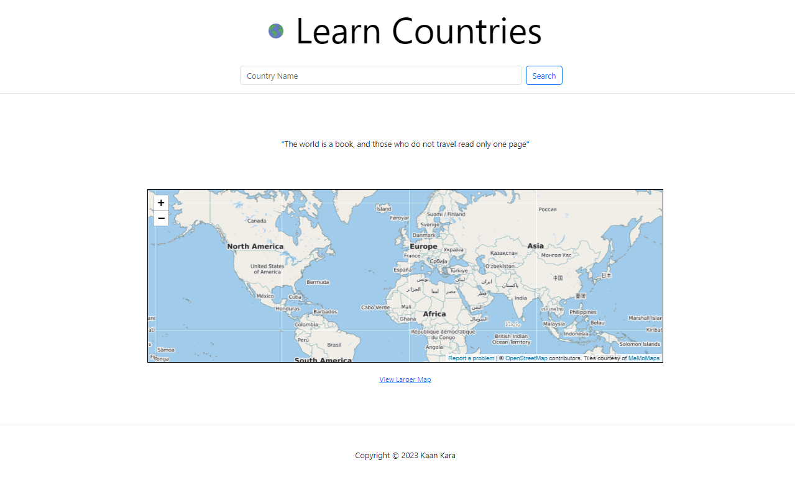
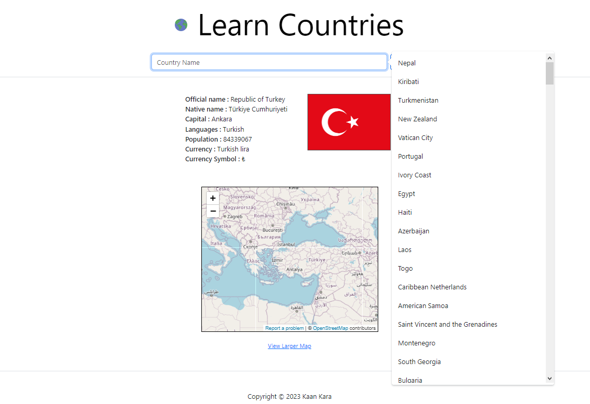
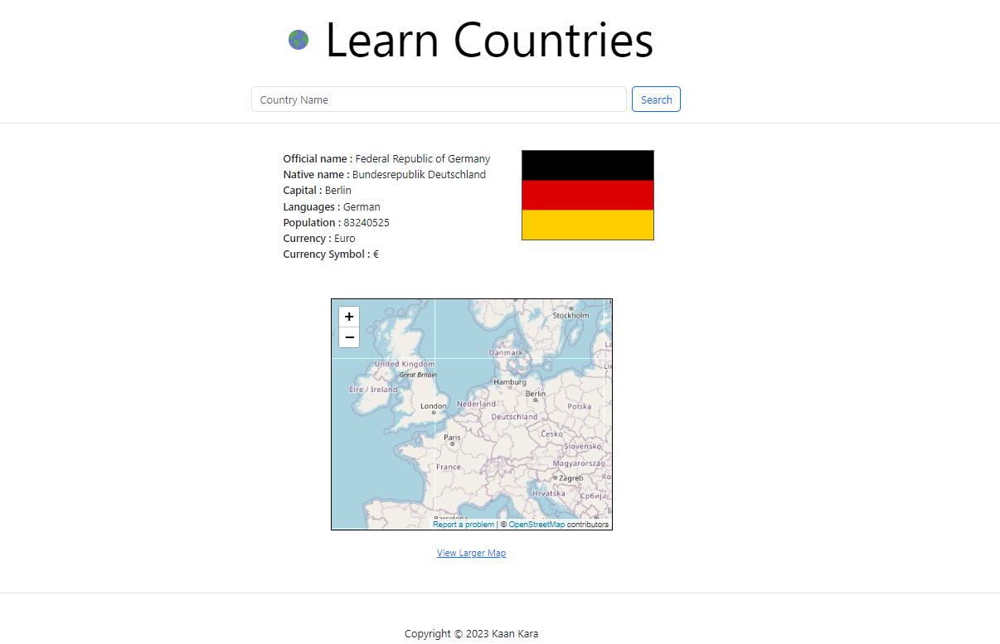

# Learn-Countries

Learn-Countries is a web application designed to help you explore and learn about countries worldwide. The project's goal is to provide users with information such as official names, local names, languages, population, currency, and flags of countries, enabling them to discover the diversity of cultures.

Note: This project utilizes a public API called [Restcountries API](https://restcountries.com/).

## Features

- **Country Search:** Learn-Countries allows users to search for countries by name or keywords, providing fast and accurate access to information.

- **Country Details:** You can access detailed information about each country, including official names, local names, spoken languages, population, currency, and flags.

- **Embedded Map:** The project displays the geographical location of the selected country on an embedded map, helping users gain a better understanding of its geographical position.

- **Responsive Style:** The project is responsive to all devices.

  

## How to Use

Using Learn-Countries is straightforward:

1. Start typing the name of a country in the search bar on the main page and select the country name in the required format from the suggestions that appear.

2. To perform a search, press the Enter key or click the search button.

3. View the details, location, and other information about the country.

## Installation

The project is designed to be run on a local server. To get started, follow these steps:

1. Install the required dependencies using the `npm install` command.

2. Start the project server by running `node index.js`.

3. Open your web browser and navigate to `http://localhost:3000`.

## Contributing

If you'd like to contribute to the Learn-Countries project, please visit the [GitHub repository](https://github.com/kaankar/Learn-Countries) and follow the contribution guidelines. All contributions and suggestions are welcome.

---

This project aims to enhance understanding and exploration of different cultures and countries around the world. Enjoy using it!
